This document is the source of truth for the `Memoize` resource function. The frontmatter is its Function Repository metadata, the Definition section inlines `Memoize.wl` from beside this file, and the example cells are evaluated when the definition notebook is built.

## Definition

```wl
(* Memoize[f] rewrites f so its results are cached. Results are stored in a private Association
   keyed on Hash[HoldComplete[args]], with the held arguments kept beside each result, so a hash
   collision recomputes instead of returning another call's value, and a verbatim Sequence or
   Unevaluated argument keeps a key of its own. Because the key is an integer hash and never a
   pattern, a call whose arguments contain Blank or Pattern is cached like any other, where
   storing it as a definition f[args] = value would define a rule that matches other calls.

   Memoize[f, crit] only caches calls for which crit[args] is True; crit is evaluated once,
   when Memoize is, and applied once on a cache miss (never on a hit), so an expensive
   criterion does not tax repeated reads, and Memoize[f] caches every call. The original
   definitions of f are kept as a dispatch table, and a miss applies them to the call itself
   with Replace, so the call matches with f's own attributes (Flat, Orderless and OneIdentity
   among them), options and defaults, and their bodies still call f, so recursion stays
   memoized. A call no definition answers stays a call of f and is not cached.

   Memoize holds its arguments, so it also takes the definitions themselves: Memoize[def], with
   def a Set, a SetDelayed or a CompoundExpression of them, makes the definitions and then
   memoizes each symbol they define at the top level, so `f[x_] := ...; // Memoize` caches f
   as it is defined. A definition whose left-hand side is headed by a System symbol, such as
   Options[f] = ... or f::tag = ..., is made but defines nothing to memoize. *)

SetAttributes[Memoize, HoldAll];

Memoize[f_Symbol, crit_ : (True &)] := With[{
    cache = Unique[f],
    unanswered = Unique[f],
    criterion = crit
},
    (* the original definitions, closed by a rule that marks a call none of them answers *)
    With[{rules = Dispatch[Append[DownValues[f], HoldPattern[_] :> unanswered]]},
        cache = <||>;
        ResourceFunction["BlockProtected"][{f},
            DownValues[f] = {
                HoldPattern[f[args___]] :> With[{held = HoldComplete[args]},
                    With[{key = Hash[held]},
                        With[{res = With[{hit = Lookup[cache, key, Missing[]]},
                            If[ ! MissingQ[hit] && First[hit] === held,
                                Last[hit],
                                With[{computed = Replace[Unevaluated[f[args]], rules]},
                                    (* a call no definition answers, a result FailureQ gives True
                                       for, and a call the criterion declines are never cached: an
                                       unanswered call is not a value, the Message side effects of a
                                       failure would be swallowed on a hit, and an abort is not an
                                       answer *)
                                    If[ computed =!= unanswered && ! FailureQ[computed] && TrueQ[criterion[args]],
                                        cache[key] = {held, computed}
                                    ];
                                    computed
                                ]
                            ]
                        ]},
                            res /; res =!= unanswered
                        ]
                    ]
                ]
            }
        ]
    ];
    f
]

Memoize[defs : _Set | _SetDelayed | _CompoundExpression, crit_ : (True &)] := With[{
    defined = DeleteDuplicates[definedSymbols[defs]]
},
    defs;
    Replace[
        Map[Replace[#, HoldComplete[f_] :> Memoize[f, crit]] &, defined],
        {f_} :> f
    ]
]

(* the symbols a definition, or a compound of definitions, defines at the top level, each
   wrapped in HoldComplete *)
SetAttributes[{definedSymbols, definedHead}, HoldAllComplete];
definedSymbols[CompoundExpression[defs___]] := Join @@ Map[definedSymbols, Unevaluated[{defs}]]
definedSymbols[(Set | SetDelayed)[lhs_, _]] := definedHead[lhs]
definedSymbols[_] := {}
definedHead[Verbatim[HoldPattern][lhs_]] := definedHead[lhs]
definedHead[Verbatim[Condition][lhs_, _]] := definedHead[lhs]
definedHead[(f_Symbol)[___]] /; Context[Unevaluated[f]] =!= "System`" := {HoldComplete[f]}
definedHead[_] := {}
```

## Usage

<code>[Memoize]()[*f*]</code> rewrites the definitions of the symbol *f* so that each distinct call of *f* is computed once and then looked up, and returns *f*.

<code>[Memoize]()[*def*]</code> makes the definitions *def* and memoizes the function they define, so definitions followed by `; // Memoize` are cached as they are made.

<code>[Memoize]()[*f*, *crit*]</code> caches only the calls whose arguments *crit* gives `True` for.

## Details & Options

- `Memoize` has the attribute [HoldAll](https://reference.wolfram.com/language/ref/HoldAll.html), so it receives definitions before they are made. Definitions followed by `; // Memoize` reach it as one [CompoundExpression](https://reference.wolfram.com/language/ref/CompoundExpression.html).
- *def* is a [SetDelayed](https://reference.wolfram.com/language/ref/SetDelayed.html), a [Set](https://reference.wolfram.com/language/ref/Set.html) or a [CompoundExpression](https://reference.wolfram.com/language/ref/CompoundExpression.html) of definitions. `Memoize[def]` makes them, then memoizes each function they define and returns it, or the list of the functions when they define several.
- Definitions in *def* whose left-hand side is headed by a system symbol, such as `Options[f] = …`, `Default[f] = …` or `f::tag = …`, are made and leave nothing else to memoize.
- `Memoize[f]` gives *f* one rule that looks each call up in a private cache. A call that is not there is computed by applying the original definitions of *f* to it, which `Memoize` keeps aside as rules.
- The original definitions still call *f*, so the calls a recursive definition makes go through the cache too.
- A call is cached under the hash of its arguments held in [HoldComplete](https://reference.wolfram.com/language/ref/HoldComplete.html), and the arguments are kept beside the value, so different calls never share a value, even when their arguments differ only by a verbatim `Sequence` or `Unevaluated`.
- The original definitions see each call as before and match it with the attributes of *f*: arguments that [SequenceHold](https://reference.wolfram.com/language/ref/SequenceHold.html) or [HoldAllComplete](https://reference.wolfram.com/language/ref/HoldAllComplete.html) keep verbatim reach them verbatim, and the definitions of an [Orderless](https://reference.wolfram.com/language/ref/Orderless.html) or [Flat](https://reference.wolfram.com/language/ref/Flat.html) function match as before.
- Arguments that contain patterns, such as `_` or `x_`, are cached like any other expression and never become definitions of *f*.
- A call that no definition of *f* answers stays unevaluated and is not cached.
- A result for which [FailureQ](https://reference.wolfram.com/language/ref/FailureQ.html) gives `True` is returned but not cached, so the call is computed again, with its messages, the next time it is made.
- Options of *f* read with [OptionValue](https://reference.wolfram.com/language/ref/OptionValue.html) and default values of its optional arguments keep working, and a call computed after [SetOptions](https://reference.wolfram.com/language/ref/SetOptions.html) reads the new options.
- In `Memoize[f, crit]` and `Memoize[def, crit]`, *crit* is evaluated once, then applied to the arguments of each computed call, and only the calls for which it gives `True` are cached. It is applied only when a call is computed, never when a call is found in the cache.
- `Memoize` changes only calls of the form *f*[*args*]. Up values, subvalues such as *f*[*a*][*b*] and own values of *f* are left as they are.

## Basic Examples

Define a function and cache its results as it is defined; the first call computes the value, as its echo shows, and a repeated call looks it up:

```wl
square[x_] := Echo[x, "computing"]^2; // Memoize
```

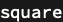

```wl
square[3]
```

> » computing 3


```wl
square[3]
```


---

All the definitions before `; // Memoize` go to it, and the calls a recursive definition makes go through the cache, so the Fibonacci recurrence computes each value once, and a later call computes only what is new:

```wl
fib[0] = 0;
fib[1] = 1;
fib[n_Integer ? Positive] := fib[Echo[n, "computing"] - 1] + fib[n - 2]; // Memoize
```

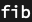

```wl
fib[5]
```

> » computing 5

> » computing 4

> » computing 3

> » computing 2


```wl
fib[6]
```

> » computing 6


## Scope

### Functions already defined

`Memoize` also rewrites a function defined earlier:

```wl
half[x_] := Echo[x, "computing"] / 2;
Memoize[half]
```

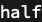

```wl
half[4]
```

> » computing 4


```wl
half[4]
```


### Choosing the calls to cache

Cache only the calls whose arguments a criterion gives `True` for; here only integer arguments are cached, so the call with `2.5` is computed each time:

```wl
double[x_] := 2 Echo[x, "computing"];
Memoize[double, IntegerQ]
```

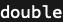

```wl
double[2]
```

> » computing 2


```wl
double[2]
```


```wl
double[2.5]
```

> » computing 2.5


```wl
double[2.5]
```

> » computing 2.5

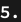

---

A definition takes a criterion too, and the criterion is applied only when a call is computed, never when a call is found in the cache:

```wl
Memoize[cube[x_] := x^3, NumericQ[Echo[#, "checking"]] &]
```


```wl
cube[2]
```

> » checking 2


```wl
cube[2]
```


## Applications

Count the monotone lattice paths across a 30 by 30 grid with the two-term recurrence, which revisits the same subproblems exponentially often without a cache:

```wl
paths[0, _] = 1;
paths[_, 0] = 1;
paths[m_Integer ? Positive, n_Integer ? Positive] := paths[m - 1, n] + paths[m, n - 1]; // Memoize
```


```wl
paths[30, 30]
```


The count agrees with the closed form, a central binomial coefficient:

```wl
Binomial[60, 30]
```

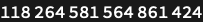

## Properties and Relations

The classic idiom `f[x_] := f[x] = …` stores each value as a definition of *f*. A call with a pattern argument then stores a definition that replaces the original one, so a later call returns the pattern's value:

```wl
classic[x_] := classic[x] = x^2
```

```wl
classic[_]
```

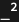

```wl
classic[3]
```


---

`Memoize` keeps its cache apart from the definitions, so the same calls give the right values:

```wl
square[x_] := x^2; // Memoize
```


```wl
square[_]
```


```wl
square[3]
```


## Possible Issues

The operator `//` binds tighter than [SetDelayed](https://reference.wolfram.com/language/ref/SetDelayed.html), so without the `;` before it, `Memoize` receives the right-hand side of the definition instead of the definition:

```wl
cubed[x_] := x^3 // Memoize
```

```wl
cubed[2]
```

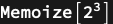

---

The cache rule answers every call first, so a definition made after `Memoize` is never used; make all definitions, then call `Memoize`:

```wl
negated[x_] := x;
Memoize[negated];
negated[x_Integer] := -x
```

```wl
negated[2]
```


---

A cached call does not repeat the messages its computation issued:

```wl
noisy::note = "computing `1`";
noisy[x_] := (Message[noisy::note, x]; x); // Memoize
```


```wl
noisy[1]
```

> noisy::note: computing 1


```wl
noisy[1]
```


---

A value that depends on something outside the arguments is cached as it was when first computed:

```wl
scale = 2;
scaled[x_] := scale x; // Memoize
```


```wl
scaled[3]
```

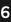

```wl
scale = 10
```

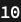

```wl
scaled[3]
```


## Neat Examples

Collatz trajectories share their tails, and the cache computes each value they pass through once; of the starting values up to 10,000, the longest trajectory starts at 6171 and takes 261 steps:

```wl
steps[1] = 0;
steps[n_ ? EvenQ] := 1 + steps[n / 2];
steps[n_] := 1 + steps[3 n + 1]; // Memoize
```

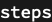

```wl
First[MaximalBy[Range[10000], steps]]
```

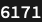

```wl
steps[6171]
```

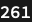

## Tests

`Memoize` returns the function it rewrites:

```wl
VerificationTest[
    Module[{f}, f[x_] := x; Memoize[f] === f],
    True,
    TestID -> "Memoize returns the function"
]
```

A definition passed to `Memoize` is made, and its function cached and returned:

```wl
VerificationTest[
    Module[{f, calls = 0}, {Memoize[f[x_] := (calls++; x^2)] === f, f[3], f[3], calls}],
    {True, 9, 9, 1},
    TestID -> "a definition passed to Memoize is made and its function cached"
]
```

All the definitions before `; // Memoize` go to it:

```wl
VerificationTest[
    Module[{fib, calls = 0},
        fib[0] = 0; fib[1] = 1; fib[n_Integer ? Positive] := (calls++; fib[n - 1] + fib[n - 2]); // Memoize;
        {fib[20], calls}
    ],
    {6765, 19},
    TestID -> "the definitions before ; // Memoize all go to it"
]
```

Definitions headed by a system symbol are made and leave nothing else to memoize:

```wl
VerificationTest[
    Module[{f},
        {Memoize[f::note = "note"; Options[f] = {"a" -> 1}; Default[f] = 3; f[x_, y_.] := x + y + OptionValue[f, "a"]] === f, f[1]}
    ],
    {True, 5},
    TestID -> "definitions headed by a system symbol are made, not memoized"
]
```

Definitions of several functions memoize each of them:

```wl
VerificationTest[
    Module[{p, q}, Memoize[p[x_] := x; q[x_] := -x] === {p, q}],
    True,
    TestID -> "definitions of several functions memoize each"
]
```

A repeated call is computed once:

```wl
VerificationTest[
    Module[{f, calls = 0}, f[x_] := (calls++; x^2); Memoize[f]; {f[3], f[3], f[4], calls}],
    {9, 9, 16, 2},
    TestID -> "a repeated call is computed once"
]
```

Each distinct combination of several arguments is computed once:

```wl
VerificationTest[
    Module[{f, calls = 0}, f[n_, k_] := (calls++; n + k); Memoize[f]; {f[1, 2], f[1, 2], f[1, 3], calls}],
    {3, 3, 4, 2},
    TestID -> "each combination of several arguments is computed once"
]
```

The calls a recursive definition makes go through the cache:

```wl
VerificationTest[
    Module[{fib, calls = 0},
        fib[0] = 0; fib[1] = 1;
        fib[n_Integer ? Positive] := (calls++; fib[n - 1] + fib[n - 2]);
        Memoize[fib];
        {fib[30], calls, fib[30], calls}
    ],
    {832040, 29, 832040, 29},
    TestID -> "recursion goes through the cache"
]
```

The criterion decides which calls are cached and is applied on a miss only:

```wl
VerificationTest[
    Module[{f, calls = 0, checks = 0},
        f[x_] := (calls++; 2 x);
        Memoize[f, (checks++; IntegerQ[#]) &];
        {f[2], f[2], f[2.5], f[2.5], calls, checks}
    ],
    {4, 4, 5., 5., 3, 3},
    TestID -> "the criterion selects the cached calls and is applied on misses only"
]
```

A failed result is not cached:

```wl
VerificationTest[
    Module[{f, calls = 0}, f[x_] := (calls++; If[x < 0, $Failed, Sqrt[x]]); Memoize[f]; {f[-1], f[-1], calls}],
    {$Failed, $Failed, 2},
    TestID -> "a failure is not cached"
]
```

A call no definition answers stays a call of the function:

```wl
VerificationTest[
    Module[{f}, f[x_Integer] := x^2; Memoize[f]; MatchQ[f["a"], HoldPattern[f["a"]]]],
    True,
    TestID -> "an unanswered call stays unevaluated"
]
```

Pattern arguments are cached without changing the definitions:

```wl
VerificationTest[
    Module[{f}, f[x_] := x^2; Memoize[f]; {f[_], f[3]}],
    {_^2, 9},
    TestID -> "pattern arguments leave the definitions alone"
]
```

A verbatim `Sequence` or `Unevaluated` argument keeps its meaning and its own cache entry:

```wl
VerificationTest[
    Module[{s, h},
        SetAttributes[s, SequenceHold];
        s[x_Sequence] := "sequence"; s[a_, b_] := "two";
        SetAttributes[h, HoldAllComplete];
        h[Unevaluated[x_]] := "unevaluated"; h[x_] := "plain";
        Memoize[s]; Memoize[h];
        {s[1, 2], s[Sequence[1, 2]], h[1 + 1], h[Unevaluated[1 + 1]]}
    ],
    {"two", "sequence", "plain", "unevaluated"},
    TestID -> "verbatim Sequence and Unevaluated arguments keep their meaning"
]
```

The definitions of an `Orderless` function match as before:

```wl
VerificationTest[
    Module[{f}, SetAttributes[f, Orderless]; f[s_String, n_Integer] := StringRepeat[s, n]; Memoize[f]; {f[3, "ab"], f["ab", 3]}],
    {"ababab", "ababab"},
    TestID -> "an Orderless function matches as before"
]
```

The definitions of a `Flat` function match as before, and its calls are cached:

```wl
VerificationTest[
    Module[{f, calls = 0},
        SetAttributes[f, {Flat, OneIdentity}];
        f[x_, y_] := (calls++; StringJoin[x, y]);
        Memoize[f];
        {f["a", "b", "c"], f["a", "b", "c"], calls}
    ],
    {"abc", "abc", 2},
    TestID -> "a Flat function matches as before"
]
```

Options and optional-argument defaults keep working:

```wl
VerificationTest[
    Module[{f, g},
        Options[f] = {"Shift" -> 1};
        f[x_, OptionsPattern[]] := x + OptionValue["Shift"];
        Default[g] = 10;
        g[x_, y_.] := x + y;
        Memoize[f]; Memoize[g];
        {f[1], f[1, "Shift" -> 5], g[1]}
    ],
    {2, 6, 11},
    TestID -> "options and defaults keep working"
]
```

Options set after `Memoize` reach the calls computed later:

```wl
VerificationTest[
    Module[{f},
        Options[f] = {"Shift" -> 1};
        f[x_, OptionsPattern[]] := x + OptionValue["Shift"];
        Memoize[f];
        SetOptions[f, "Shift" -> 3];
        f[10]
    ],
    13,
    TestID -> "options set after Memoize reach the calls computed later"
]
```

## Author Notes

`Memoize` was written by Nikolay Murzin. This resource was drafted with Claude Opus 5.5 (Anthropic), under the author's supervision: the model shaped the implementation, which keeps the original definitions as rules and applies them to each computed call, so a call matches with the attributes, options and defaults of the function itself, and it wrote this documentation, the examples and the tests.
